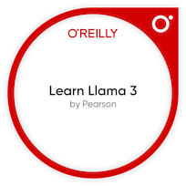

##  💼 Career Snapshot

After more than 15 years turning raw data into stories that shape policy, drive innovation, and influence major decisions, I’ve learned one truth: numbers alone don’t change the world—insight does. Armed with a PhD in Statistics and a career spanning government, finance, public policy, and the commercial arena, I’ve built my reputation on transforming complexity into clarity.

From deploying scalable machine learning solutions to training language models in the cloud, my work bridges cutting-edge technology with real-world impact. Whether it’s NLP and generative AI or leveraging Azure, Python, R, Spark, Databricks, and MLflow, I’ve consistently delivered tools and insights that don’t just solve problems—they redefine possibilities.

------------------------------------------------------------------------

## 🧰 Technical Proficiencies

| Category | Skills |
|------------------------------------|------------------------------------|
| **Cloud Platforms** |    |
| **Languages** |    |
| **Frameworks & Productivity** |     |
| **LLM & Deep Learning** | BERT, T5, RNN (LSTM), CNN, GAN, RAG, Prompt Engineering, TensorFlow, PyTorch |
| **Machine Learning & Statistics** | Classification, Regression, Clustering, Forecasting, Anomaly Detection, Bayesian modelling, Bayesian Network, Monte Carlo Simulation |

------------------------------------------------------------------------

## Certifications

